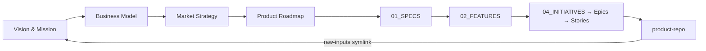

---
metadata:
  status: TEMPLATE
  modules: []
  tldr: "Level 0 root — business strategy, legal, brand, full scaffold"
  dependencies: []
  code_refs: []
---

# n8n

> Level 0 venture root: strategy, legal, brand, and organizational execution.

## When to Use This Profile

**Use when** you are starting the top of a product hierarchy — capturing mission, business model, market strategy, legal, and cross-product governance.

**Do NOT use when** you only need product execution detail — use `product-repo` instead. `venture-repo` is the parent; `product-repo` lives inside it.

## Directory Map

| Directory | Purpose |
|-----------|---------|
| `00_DOCS/01_vision-foundations/` | Mission, vision, principles, BRD/PRD/TRD |
| `00_DOCS/02_business-model/` | Revenue model, pricing, cost structure |
| `00_DOCS/03_legal/` | IP, ToS, privacy policy |
| `00_DOCS/04_target-audience/` | Personas, anti-personas, decision framework |
| `00_DOCS/05_strategy/` | Competitive analysis, GTM, market positioning |
| `00_DOCS/06_product/` | Product roadmap, feature matrix |
| `00_DOCS/07_ux-strategy/` | Brand voice, customer journeys |
| `00_DOCS/08_marketing/` | Brand guidelines, marketing plan |
| `00_DOCS/09_content/` | Content strategy, content calendar |
| `00_DOCS/10_community/` | Community strategy, engagement playbook |
| `00_DOCS/11_operations/` | SOPs, runbooks, AI agent definitions |
| `00_DOCS/12_success-metrics/` | OKRs, KPIs, milestones |
| `01_SPECS/` | Organizational specs (compliance, legal, API contracts) |
| `02_FEATURES/` | High-level organizational features and acceptance criteria |
| `03_TESTING/` | Governance and compliance testing |
| `04_INITIATIVES/` | Strategic bets |
| `05_EPICS/` — `09_BUGS/` | Execution tracking |

## Flow

## First Steps

1. Fill `00_DOCS/01_vision-foundations/mission-vision.md`.
2. Define target audience in `00_DOCS/04_target-audience/personas/`.
3. Draft business model in `00_DOCS/02_business-model/`.
4. Create a roadmap in `00_DOCS/06_product/roadmap.md`.
5. Open `04_INITIATIVES/` and create the first strategic initiative.
6. Run `aigile sync scan` to index all files.

---

*Managed with [AIGILE](https://github.com/vladimir-ks/aigile) — AI-first agile system.*
